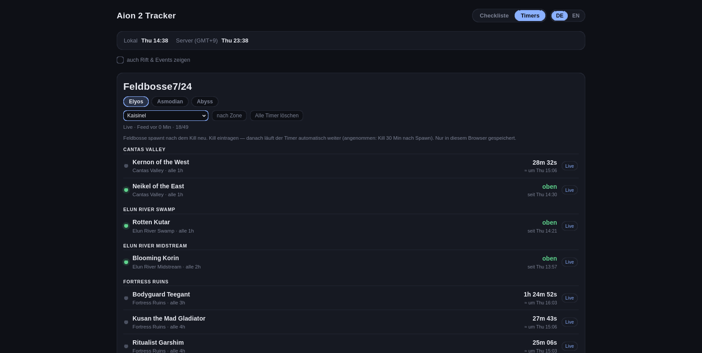

# Aion 2 Tracker

A single-file, dependency-free web tracker for **AION 2** — a daily/weekly checklist plus field-boss respawn timers.

No build step, no server, no external requests. Open `index.html` in a browser (or host it anywhere static) and it just works.



## Features

**Checklist page**
- Dailies, weeklies and season tasks, split into account-wide and per-character
- Multiple characters with an inline add/remove list
- Configurable weekly reset day/time; dailies and weeklies reset themselves automatically
- Odyle Energy tracker per character, with refill projection and a "caps in under 24 h" warning
- Progress bars per section

**Timers page**
- **Field bosses** — all 49 (24 Elyos, 24 Asmodian, 1 Abyss), grouped by zone
- **Live mode:** pick your server and the timers come from a community kill feed — real `up`/`dead` state with actual spawn timestamps for every boss on that server, refreshed every 60 s. Values the feed is still estimating are marked `≈`
- **Manual mode:** with no server selected, tap **Killed** when you kill one; the timer then keeps rolling on its own (assumes a kill 30 min after each spawn) so it stays roughly accurate without further input
- Filter by faction, sort by zone or by next respawn, clear all manual timers at once
- Optional panel for other timed events (Spacetime Rift, Shugo Festival, Dimensional Invasion)

## Usage

```bash
git clone https://github.com/MythosOfs/aion2-tracker.git
cd aion2-tracker
xdg-open index.html      # or just double-click it
```

Everything is stored in a cookie on your own device — nothing is sent anywhere.

### Hosting

Because it is a single static file, any static host works (GitHub Pages, Cloudflare Pages, nginx, Caddy, …). If you serve it behind a reverse proxy, a plain `file_server` on the directory containing `index.html` is all that is needed.

### Live data (optional, needs a proxy)

Live timers read the community feed behind [aion2timers.com](https://www.aion2timers.com/world-boss-timer/), which is fed by players running the AbyssLogs DPS meter. That API sends no CORS header, so a browser cannot call it cross-origin. The page therefore requests it from `<origin>/fbapi/api/fieldboss.php`, which must be proxied to the upstream API by whatever serves the file.

Caddy example — add inside the site block, before `file_server`:

```caddyfile
handle_path /fbapi/* {
    @fbnotget not method GET HEAD
    respond @fbnotget 405
    reverse_proxy https://www.aion2timers.com {
        header_up Host www.aion2timers.com
        header_up User-Agent "Mozilla/5.0 (X11; Linux x86_64) AppleWebKit/537.36 (KHTML, like Gecko) Chrome/131.0.0.0 Safari/537.36"
        header_up Accept "application/json, */*"
        header_up -Cookie
        header_up -Origin
        header_up -Referer
    }
}
```

The browser-style `User-Agent` is required: the upstream sits behind Cloudflare and answers non-browser user agents with a 403 challenge. Without the proxy, live mode stays off on its own and the manual timers are used.

## Data sources

- **Field boss list, respawn cycles and live kill feed** — [aion2timers.com](https://www.aion2timers.com/world-boss-timer/) (kill data contributed by AbyssLogs DPS meter users)
- **Reset times and event schedules** — community reports

Respawn cycles are community-maintained and can change with patches; treat every countdown as an estimate and re-log a real kill to re-sync it.

## Notes / limitations

- Field boss respawns are **kill-based**, so no static page can know the exact state without live kill data. This tracker therefore relies on the kill you log, then extrapolates.
- AION 2 has no official API for boss spawns or kills. Live data depends on a third-party community feed — if it changes or goes away, the tracker falls back to manual timers.
- Live accuracy depends on someone running the meter on your server; bosses nobody has killed recently show as estimated.
- Only affects the browser it is opened in.

## Disclaimer

Unofficial fan project. Not affiliated with, endorsed by, or sponsored by NCSOFT. Aion 2 and all related logos, characters and assets are trademarks or registered trademarks of NCSOFT Corporation.

## License

[MIT](LICENSE)